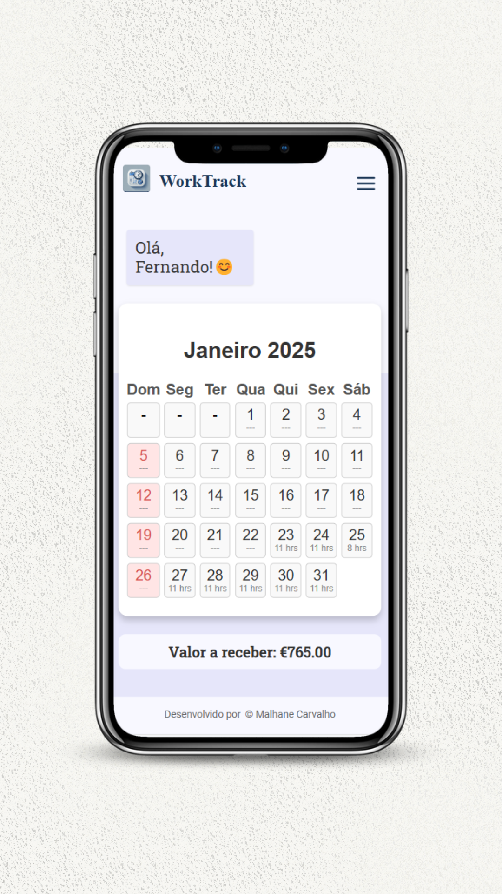

# 📅 WorkTrack

  

🚀 Um aplicativo simples e eficiente para **controle de horas trabalhadas** com um calendário interativo.

  



  

---

  

## 🌟 **Recursos**

✅ Interface intuitiva e responsiva 📱

✅ Registro de horas direto no calendário 📝

✅ Cálculo automático de ganhos 💰

✅ Envio de relatórios via **EmailJS** 📧

✅ Modo escuro 🌙 (Em breve!)

✅ Design moderno com animações suaves 🎨

  

---

  

## 🛠️ **Tecnologias Utilizadas**

- ⚛️ **React.js** - Estrutura do front-end

- 🎨 **CSS3 + Styled Components** - Estilização responsiva

- 🔄 **React Hooks** - Gerenciamento de estado eficiente

- 📧 **EmailJS** - Envio de e-mails automatizados sem back-end

  

---

## 📌 **Próximas Melhorias**

🔹 Modo Escuro automático 🌙  
🔹 Exportação de dados em PDF 📄  
🔹 Integração com Google Calendar 📅


## 👨‍💻 **Desenvolvido por**

💙 Feito com dedicação por **Malhane Carvalho**  
📧 Contato: malhanesilva26@gmail.com  
🔗 GitHub: [github.com/malhanecarvalho](https://github.com/malhanecarvalho)

  

## 📥 **Instalação e Execução**

Siga os passos abaixo para rodar o projeto localmente:

  

````bash

# Clone o repositório

git  clone  https://github.com/malhanecarvalho/worktrack-frontend.git

# Entre no diretório do projeto

cd  work-track

# Instale as dependências

npm  install

# Execute o projeto

npm  run  dev  


